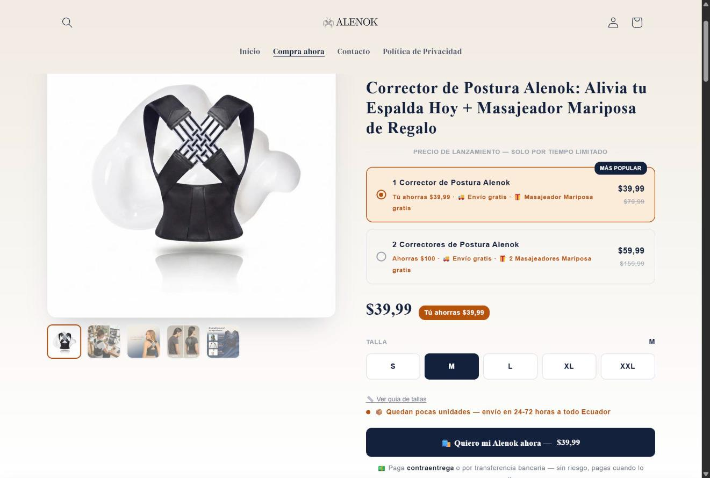

# Alenok — Shopify E-commerce


A real direct-to-consumer e-commerce store for a posture-correction product in
Ecuador, built on Shopify with custom Liquid sections, a custom cart and a
conversion-focused product page designed mobile-first for a cash-on-delivery market.

> **About this repository.** This is a curated **portfolio showcase**, not the
> store's source code. It contains selected, simplified excerpts, the
> architecture and the engineering decisions behind the project. The production
> codebase is kept private.

---

## 🔗 Demo

| | |
|---|---|
| 🛒 **Live store** | [www.alenok.com](https://www.alenok.com) |
| 🎬 **Video walkthrough** | _Coming soon_ <!-- https://youtu.be/... --> |
| 👤 **Portfolio** | _Coming soon_ <!-- https://your-portfolio-url --> |

## 📸 Screenshots

<sub>Real captures of the live store (Shopify admin bar hidden).</sub>

| Home — desktop | Product page — desktop |
|---|---|
|  |  |

| Product page — mobile | Before / After section |
|---|---|
|  |  |


---

## 🎯 Objective

Launch a professional, trustworthy store that converts first-time visitors —
mostly arriving from TikTok, Instagram and Meta Ads on their phones — into
paying customers, in a market where many shoppers distrust online card payments.

## 🧩 Challenge

- **Trust.** A brand-new store with no reviews, selling a health-related product, must look credible within seconds.
- **Local payment habits.** Cash on delivery and bank transfer instead of card-first checkout.
- **Mobile performance.** Most traffic comes from social apps on mid-range phones and mobile data.
- **Bundle pricing.** A "buy 2, save more" offer that had to show *exact* prices everywhere — product page, cart and checkout.
- **Merchant autonomy.** The owner needed to change images, reviews and copy without touching code.
- **Coexisting with a theme.** Custom pages had to live inside an existing theme without breaking it.

## 💡 Solution

- **Four custom Online Store 2.0 sections** (landing, product page, cart, contact) layered on top of an existing theme instead of forking it — safe theme updates, independent rollbacks.
- **Scoped design system** (CSS custom properties under a single namespace + `isolation: isolate`) so custom pages and theme never collide.
- **Fully schema-driven content:** images, videos, reviews, features and FAQs are editable from the theme editor; no hard-coded media.
- **Custom cart with optimistic UI** on top of Shopify's Ajax Cart API: instant feedback, server reconciliation, fail-safe recovery.
- **Discount strategy redesigned** after diagnosing per-unit rounding and line-item allocation limits in Shopify (see [Engineering notes](docs/ENGINEERING-NOTES.md)).
- **Zero dependencies:** vanilla JS and CSS, no jQuery or carousel libraries.

## ✨ Features

- Conversion-focused product page with gallery, quantity-bundle selector and live price updates
- Variant option chips generated automatically from the product's options (size guide modal included)
- Custom cart: instant quantity updates, bundle savings, compare-at reference price, order notes
- Before/after and "how to use" sections with an auto-advancing stepper
- Swipeable reviews carousel built with native CSS scroll-snap
- Sticky "buy" bar on mobile once the buy box scrolls out of view
- Cash-on-delivery and bank-transfer payment flow messaging across the funnel
- Repeatable blocks for reviews, features and FAQ, managed from the theme editor

## 🛠 Technologies

| Area | Stack |
|---|---|
| Platform | Shopify (Online Store 2.0 sections, schema settings & blocks) |
| Templating | Liquid |
| Front-end | HTML5, CSS3 (custom properties, Grid, Flexbox, scroll-snap), vanilla JavaScript |
| Shopify APIs & features | Ajax Cart API (`/cart/change.js`), automatic discounts, manual payment methods |
| Integrations | Meta Pixel & catalog via Shopify's Facebook & Instagram channel |
| Tooling | Git / GitHub, Chrome DevTools, Python (SVG logo generation) |

## 👨‍💻 What I built

- Designed and developed the four custom sections end to end: markup, styles, behaviour and schema
- Built the custom cart page and its optimistic-update logic
- Implemented the variant resolver and option chips
- Designed the scoped design system (palette, typography, spacing, motion)
- Diagnosed and resolved the discount and pricing issues described in the engineering notes
- Configured payments, discounts and the Meta integration in the Shopify admin
- Created the brand identity: logo system generated programmatically as SVG

## 🎨 UX/UI decisions

- **Trust signals placed at the point of decision** — payment, shipping and gift information sits directly under the main CTA, not in the footer.
- **One primary action per screen** — a single high-contrast copper CTA colour reserved for buying.
- **Bundle selector as cards, not a dropdown** — savings are visible before the shopper commits.
- **Honest claims** — explicit disclaimers on before/after visuals and on review sources.
- **Accessible interactions** — visible keyboard focus, ARIA roles on option chips, 44 px touch targets, `prefers-reduced-motion` respected.

## 📱 Responsive design

Mobile-first, with **content-driven breakpoints** (where the layout actually breaks) instead of device presets:

| Breakpoint | Change |
|---|---|
| ≤ 1050 px | 3-column feature grid → single column |
| ≤ 900 px | Product page gallery/buy box stack; sticky mobile CTA activates |
| ≤ 860 px | Cart summary moves below the items |
| ≤ 640 px | Video grid → single column; enlarged touch targets |

Safe-area insets keep the sticky bar clear of the iPhone home indicator. → [`src/styles/responsive-patterns.css`](src/styles/responsive-patterns.css)

## 🛒 E-commerce

- Bundle pricing that is **exact to the cent** across product page, cart and checkout
- Native product form kept as the source of truth (works even if JS fails)
- Cart reconciliation with Shopify's authoritative totals — the client never decides what the customer pays
- Payment methods adapted to the local market: cash on delivery and bank transfer
- Post-add-to-cart redirect straight to the custom cart to shorten the path to checkout

## 🧠 Engineering highlights

| Problem | Root cause | Notes |
|---|---|---|
| Bundle showed $60.00 instead of $59.99 | Per-unit rounding of percentage product discounts | [#1](docs/ENGINEERING-NOTES.md#1-the-bundle-showed-6000-instead-of-5999) |
| Discount missing from line price | Order-level discounts aren't allocated to `final_line_price` | [#2](docs/ENGINEERING-NOTES.md#2-order-level-discounts-dont-reach-the-line-item) |
| Cart buttons did nothing | `json` filter quotes colliding with an inline handler | [#3](docs/ENGINEERING-NOTES.md#3-remove-and-quantity-buttons-silently-did-nothing) |
| ~0.5 s lag per tap | Network round-trip | [#5](docs/ENGINEERING-NOTES.md#5-perceived-lag-on-every-quantity-change) |

Full write-ups: [docs/ENGINEERING-NOTES.md](docs/ENGINEERING-NOTES.md) · Architecture: [docs/ARCHITECTURE.md](docs/ARCHITECTURE.md)

## 📁 Repository structure

```
alenok-shopify-portfolio/
├── docs/
│   ├── ARCHITECTURE.md          # Section architecture, principles, data flow
│   ├── ENGINEERING-NOTES.md     # Real problems, diagnosis and trade-offs
│   └── images/                  # Screenshots (capture list inside)
├── src/                         # Selected, simplified excerpts — not the full store
│   ├── cart/
│   │   ├── cart-line-item.liquid    # Line item + order-level discount workaround
│   │   └── optimistic-cart.js       # Predict → lock → reconcile → fail safe
│   ├── product/
│   │   ├── option-chips.liquid      # Auto-generated variant option chips
│   │   └── variant-resolver.js      # Option combination → variant id
│   ├── sections/
│   │   └── before-after-grid.liquid # Dynamic setting keys + schema
│   ├── ui/
│   │   └── reveal-and-stepper.js    # IntersectionObserver reveal + stepper
│   └── styles/
│       ├── scoped-design-tokens.css # Namespaced tokens & isolation
│       └── responsive-patterns.css  # Layout breakpoints, scroll-snap, sticky CTA
├── LICENSE                      # All rights reserved — viewing only
└── README.md
```

## 🔐 Security

This public version was prepared from the private production codebase after a
security review. It contains **no API keys, access tokens, passwords, payment
credentials, internal store identifiers, customer data or personal contact details**.
Business rules (prices, promotions) are replaced by injected parameters and the
store's marketing copy and media are not included.

## 📄 License

**© 2026 Fredy Espinoza — All rights reserved.** Published for portfolio viewing
only. Reuse, copying, modification or redistribution — commercial or not —
requires prior written permission. See [LICENSE](LICENSE).

---

<sub>Interested in a similar project? Reach out through my profile.</sub>
