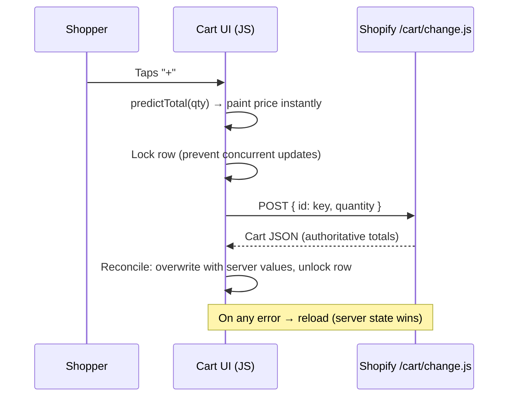
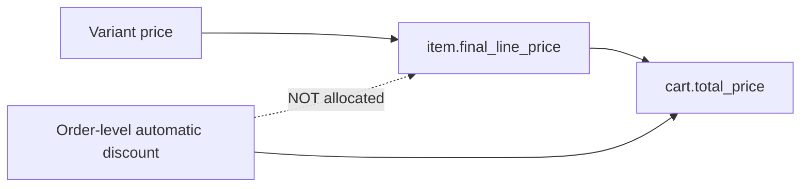

# Architecture

## Approach: custom sections on top of an existing theme

Instead of forking and maintaining a full theme, the store is built from
**four self-contained Online Store 2.0 sections** that plug into an existing
Shopify theme. The theme keeps providing what it does well (header, footer,
checkout, SEO plumbing, app blocks); the custom sections own the
conversion-critical pages.

| Section | Responsibility |
|---|---|
| Landing | Brand story, video, before/after, how-to-use stepper, reviews, newsletter |
| Sales page (PDP) | Gallery, bundle selector, variant chips, size guide modal, sticky mobile CTA |
| Cart | Custom cart with optimistic quantity updates and bundle-aware pricing |
| Contact | Contact channels and support information |

**Why:** theme updates stay safe (no forked core files), each page can be
developed and rolled back independently, and the merchant can reorder or
disable sections from the theme editor without touching code.

## Design principles

**1. Isolation.** All CSS lives under `.aln-scope` with locally defined custom
properties and `isolation: isolate` — the sections cannot break the theme and
the theme cannot break the sections. → `src/styles/scoped-design-tokens.css`

**2. Merchant-editable, zero hard-coded media.** Every image and video is a
schema setting (`image_picker`, `video`) or a repeatable block (reviews,
features, FAQ). No CDN URLs in code, so content changes never require a deploy.
→ `src/sections/before-after-grid.liquid`

**3. Server-rendered first, JavaScript second.** Liquid renders complete,
working HTML (the product form posts natively). JS only enhances it: instant
price updates, chips, carousel, sticky CTA.

**4. Server state is the source of truth.** The client predicts for speed but
always reconciles with Shopify's response. → `src/cart/optimistic-cart.js`

**5. No dependencies.** Vanilla JS and CSS — no jQuery, no carousel library,
no build step. Native `IntersectionObserver` and CSS `scroll-snap` cover the
interactive needs at a fraction of the weight.

## Cart data flow

## Pricing model and where discounts live

Order-level automatic discounts affect only `cart.total_price`. This single
fact drove several design decisions — see [ENGINEERING-NOTES.md](ENGINEERING-NOTES.md).

## Payments & integrations (configuration, not custom code)

- Manual payment methods for the local market: **cash on delivery** and **bank transfer**
- Automatic discount configured as a **fixed amount at order level** (see notes on rounding)
- Meta Pixel and product catalog through Shopify's native *Facebook & Instagram* channel
